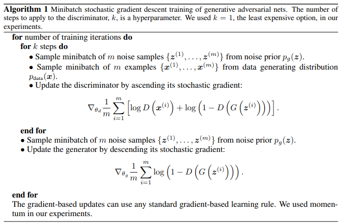

# Generative Adversarial Nets

To learn the generator's distribution $P_g$ over data $x$, we define a prior on input noise variables $p_z(Z)$, then represent a mapping to data space as $G\left(\boldsymbol{z} ; \theta_g\right)$, where $G$ is a differentiable function represent by a multilayer perceptron(NOTE: can use novel NN as well?) with parameters $\theta_g$. Also define a second MLP $D\left(\boldsymbol{x} ; \theta_d\right)$ that outputs a single scalar. $D(x)$ represents the probability that $x$ came from the data rather than $p_g$. Training $D$ to maximize the probability of assigning the correct label to both training examples and samples from $G$. We simultaneously train $G$ to minimize $\log (1-D(G(z)))$. Lets say this is a minimax optimization task with value function $V(G, D)$

$$
\begin{equation}
\min _G \max _D V(D, G)=\mathbb{E}_{\boldsymbol{x} \sim p_{\text {data }}(\boldsymbol{x})}[\log D(\boldsymbol{x})]+\mathbb{E}_{\boldsymbol{z} \sim p_{\boldsymbol{z}}(\boldsymbol{z})}[\log (1-D(G(\boldsymbol{z})))] .
\end{equation}
$$

In practice, equation 1 may not provide sufficient gradient for $G$ to learn well. Early in learning, when $G$ is poor, $D$ can reject samples with high confidence because they are clearly different from the training data. In this case, $\log (1-D(G(\boldsymbol{z})))$ saturates. Rather than training $G$ to minimize $\log (1-D(G(\boldsymbol{z})))$ we can train $G$ to maximize $\log D(G(\boldsymbol{z}))$. This objective function results in the same fixed point of the dynamics of $G$ and $D$ but provides much stronger gradients early in learning.

## GAN Algorithm

### Global Optimality of $p_g = p_{\text{data}}$

We first consider the optimal discriminator $D$ for any given generator $G$.

**Proposition 1.** *for G fixedm the optimal discriminator $D$ is*
$$
\begin{equation}
D_G^*(\boldsymbol{x})=\frac{p_{\text {data }}(\boldsymbol{x})}{p_{\text {data }}(\boldsymbol{x})+p_g(\boldsymbol{x})}
\end{equation}
$$

*proof.* The training criterion for the discrimininator $D$, given any generator $G$, is to maximize the quantity $V(G,D)$.
$$
\begin{equation}
\begin{aligned}
V(G, D) & =\int_{\boldsymbol{x}} p_{\text {data }}(\boldsymbol{x}) \log (D(\boldsymbol{x})) d x+\int_{\boldsymbol{z}} p_{\boldsymbol{z}}(\boldsymbol{z}) \log (1-D(g(\boldsymbol{z}))) d z \\
& =\int_{\boldsymbol{x}} p_{\text {data }}(\boldsymbol{x}) \log (D(\boldsymbol{x}))+p_g(\boldsymbol{x}) \log (1-D(\boldsymbol{x})) d x
\end{aligned}
\end{equation}
$$

*Details of proof.* Since $g$ maps $z$ to $x$. Let $x = g(z)$. The probability density of $x$ under the generator is $p_g(x)$, which is the pushforward of $p_z(z)$ through $g$.

For any function $f$, we have
$$
\int_z p_z(z) f(g(z)) d z=\int_x p_g(x) f(x) d x
$$
This is the definition of the **law of the unconscious statistician(LOTUS)** for probability distributions.
$$
\begin{aligned}
&\text { Let } f(g(z))=\log (1-D(g(z))) \text {. Then: }\\
&\int_{\boldsymbol{z}} p_{\boldsymbol{z}}(\boldsymbol{z}) \log (1-D(g(\boldsymbol{z}))) d \boldsymbol{z}=\int_{\boldsymbol{x}} p_g(\boldsymbol{x}) \log (1-D(\boldsymbol{x})) d \boldsymbol{x}
\end{aligned}
$$
Q.E.D

As long as we get Equation 3. We set $\frac{\partial V}{\partial D}=0$ yields to Equation 2.

### Optimal Discriminator

$D^*(\boldsymbol{x})$ is the probability that $\boldsymbol{x}$ came from the real data rather than the generator.

- If $p_{\text {data }}(\boldsymbol{x}) \gg p_g(\boldsymbol{x}), D^*(\boldsymbol{x}) \approx 1$ (confident real).
- If $p_g(\boldsymbol{x}) \gg p_{\text {data }}(\boldsymbol{x}), D^*(\boldsymbol{x}) \approx 0$ (confident fake).
- If $p_{\text {data }}(\boldsymbol{x})=p_g(\boldsymbol{x}), D^*(\boldsymbol{x})=\frac{1}{2}$ (maximal confusion).

Connection to JSD:

Substituting $D^*$ back into $V(G, D)$ shows that the generator minimizes the Jensen-Shannon Divergence (JSD) between $p_{\text {data }}$ and $p_g$.

### Second Derivative Check(Concavity)

To confirm this is a maximum, compute the second derivative:

$$
\frac{\partial^2 f}{\partial D^2}=-\frac{p_{\text {data }}(\boldsymbol{x})}{D^2}-\frac{p_g(\boldsymbol{x})}{(1-D)^2}<0 \quad \text { (always negative) }
$$

Thus, $D^*$ is indeed the maximizer.
